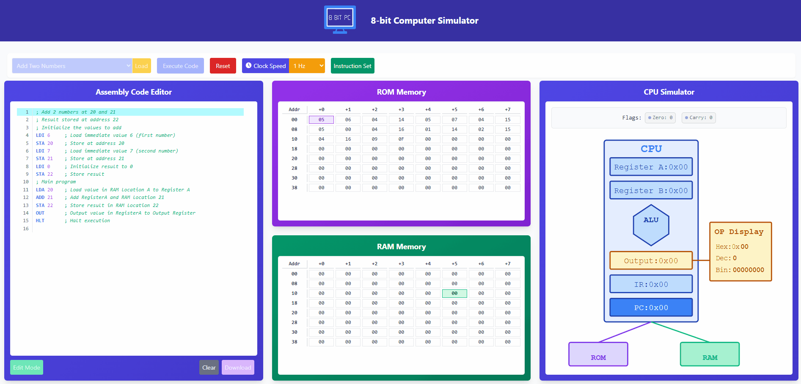

# 8-bit Computer Simulator

A web-based simulator for an 8-bit computer architecture with visual components, memory visualization, and assembly language programming capabilities.



## Project Overview

This project implements a functional 8-bit computer simulator in a web browser. It provides an interactive environment for learning about computer architecture fundamentals through direct programming and visualization of CPU operations.

## Features

### Web Interface Components

- **Assembly Code Editor**: Write your own assembly programs or load from provided examples
- **Memory Visualization**: ROM and RAM displays with address headers
- **CPU Component Visualization**: Interactive display of active CPU components during execution
- **Control Panel**: Interface for program execution and simulation control
- **Code Management**: Download your assembly code for later use

### CPU Architecture

- **Registers**: Register A, Register B
- **Control Components**: 
  - Program Counter
  - Instruction Register
- **Processing Unit**: ALU (Arithmetic Logic Unit)
- **Output System**: Output Register
- **Memory System**: RAM and ROM memory modules
- **Instruction Set**: Basic operations
  - `NOP` - No Operation
  - `LDA` - Load value from memory address into A register
  - `ADD` - Add value from memory address to A register
  - `SUB` - Subtract value from memory address from A register
  - `STA` - Store A register to memory address
  - `LDI` - Load immediate value into A register
  - `JMP` - Jump to memory address
  - `JC`  - Jump if carry flag is set
  - `JZ`  - Jump if zero flag is set
  - `OUT` - Output Register A to the output register
  - `HLT` - Halt program execution

### Visualization Features

- **Active Component Highlighting**: Visual indicators showing which components are active during execution
- **Memory Access Visualization**: Highlights memory addresses being read from or written to
- **Register Value Display**: Real-time display of current register values
- **Output Display**: Results shown in multiple formats (Hexadecimal, Decimal, and Binary)

### Program Control Functions

- **Execution Controls**: Execute all instructions or step through one at a time
- **Clock Speed Control**: Adjust simulation speed
- **Reset Functionality**: Return system to initial state

### Additional Features

- **Code Navigation**: Highlighting of the current instruction line being executed
- **Variable Simulation Speed**: Wide range of clock speeds to simulate program execution
- **Sample Programs**: 10 pre-built examples to demonstrate capabilities and provide learning resources

## Live Demo

[View the live demo](https://your-demo-link-here.com) (Coming soon)

## Technology Stack

- **Backend**: Django REST Framework
- **Frontend**: React.js with Tailwind CSS
- **Database**: SQLite (development) / PostgreSQL (production)

## Installation

### Prerequisites

- Python 3.8+
- Node.js 16+
- npm or yarn

### Backend Setup

```bash
# Clone the repository
git clone https://github.com/your-username/eightbit-simulator.git
cd eightbit-simulator

# Create a virtual environment
python -m venv venv
source venv/bin/activate  # On Windows: venv\Scripts\activate

# Install dependencies
cd backend
pip install -r requirements.txt

# Run migrations
python manage.py migrate

# Load initial data
python manage.py loaddata simulator/fixtures/instruction_set.json
python manage.py loaddata simulator/fixtures/example_programs.json

# Start the development server
python manage.py runserver
```

### Frontend Setup

```bash
# Navigate to the frontend directory
cd ../frontend

# Install dependencies
npm install  # or: yarn install

# Start the development server
npm start  # or: yarn start
```

## Project Structure

```
eightbit_simulator/
├── backend/                    # Django project
│   ├── eightbit_simulator/     # Django project settings
│   │   ├── settings.py
│   │   ├── urls.py
│   │   ├── asgi.py
│   │   └── wsgi.py
│   ├── simulator/              # Django app
│   │   ├── migrations/
│   │   ├── fixtures/           # Initial data
│   │   │   ├── instruction_set.json
│   │   │   └── example_programs.json
│   │   ├── admin.py
│   │   ├── apps.py
│   │   ├── models.py
│   │   ├── serializers.py
│   │   ├── tests.py
│   │   └── views.py
│   ├── manage.py
│   └── requirements.txt
│
├── frontend/                   # React application
│   ├── public/
│   ├── src/
│   │   ├── api/
│   │   │   └── simulatorApi.js
│   │   ├── components/
│   │   │   └── EightBitSimulator.js
│   │   ├── lib/
│   │   │   └── cpu.js
│   │   ├── App.js
│   │   ├── index.js
│   │   └── index.css
│   ├── package.json
│   └── tailwind.config.js
│
├── README.md
│
└── LICENSE.MD
```

## Future Enhancements

Here are some ideas for extending the 8-bit computer simulator:

1. Add more instructions: Implement more CPU instructions like bitwise operations, stack operations, etc.
2. Memory visualization: Add a visual representation of memory access and data movement.
3. Add I/O capabilities: Implement simulated I/O devices like a display, keyboard input, etc.
4. Debugging tools: Add breakpoints, step-by-step execution, and variable inspection.
5. Assembly editor improvements: Syntax highlighting, error checking, and autocompletion.
6. Save/load programs: Allow users to save their programs and load them later.
7. Improved visualization: Create animations for the data flow between components.
8. Performance metrics: Add execution statistics like cycle count, instruction frequency, etc.

## Contributing

Contributions are welcome! Please feel free to submit a Pull Request.

1. Fork the repository
2. Create your feature branch (`git checkout -b feature/amazing-feature`)
3. Commit your changes (`git commit -m 'Add some amazing feature'`)
4. Push to the branch (`git push origin feature/amazing-feature`)
5. Open a Pull Request

## License

This project is licensed under the MIT License - see the [LICENSE](LICENSE.MD) file for details.

## Acknowledgements

- Inspired by the Ben Eater 8-bit breadboard computer
- Built using Django and React frameworks
